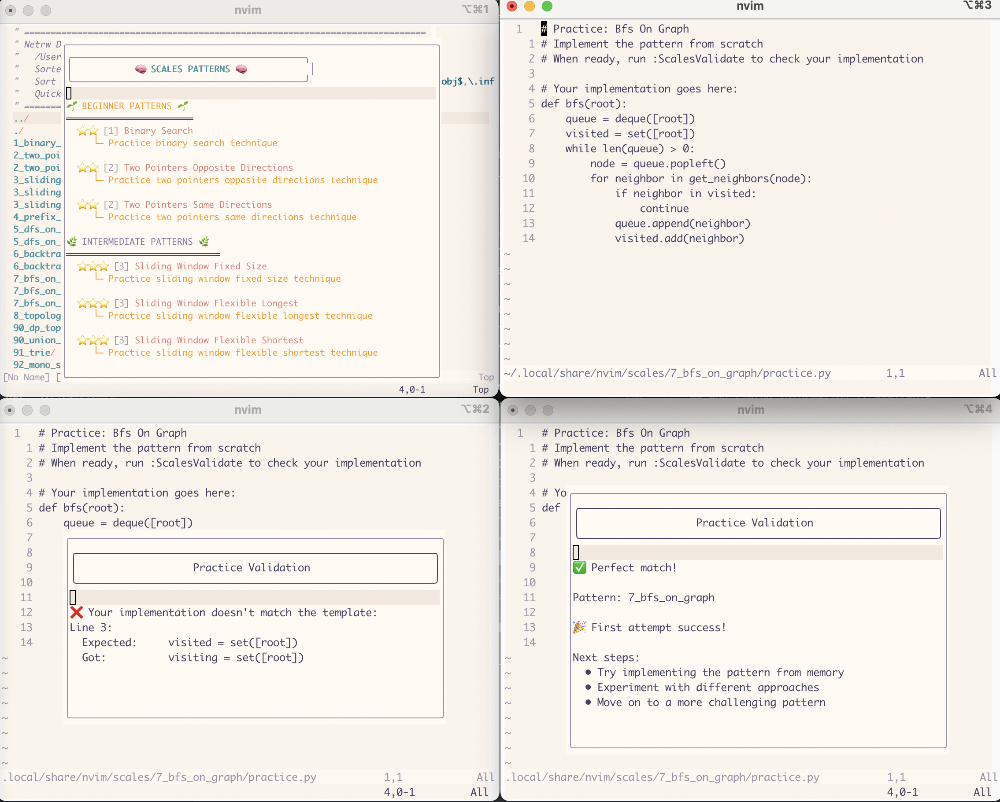
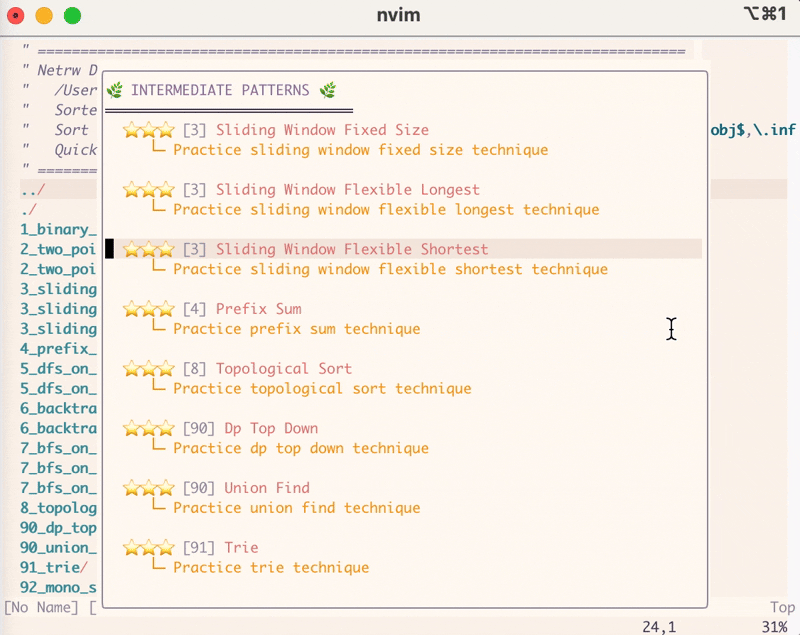

# 🎸 Scales.nvim

> 🎵 *"You want to be like this in your next interview? Start with the basics."*

[](https://www.youtube.com/watch?v=L9r-NxuYszg&t=512)

Practice coding patterns like a musician practices scales. Just as guitarists master scales to build muscle memory and improvisation skills, this Neovim plugin helps you master common coding patterns through deliberate practice.


*Scales.nvim in action: Pattern selection (top-left), Practice implementation (top-right), Validation feedback (bottom)*

## 🎵 Why Practice Scales?

> 🎸 *"You wouldn't try to play ['Eruption'](https://youtu.be/L9r-NxuYszg?si=ZiNbsVDLcTxvqY40&t=307) without learning your scales first. Don't try to solve complex problems without mastering the basics."*

Every great musician knows that mastering scales is the foundation of musical excellence. Similarly, in coding:

- 🎸 Scales build muscle memory → Coding patterns build problem-solving reflexes
- 🎵 Scales enable improvisation → Patterns enable algorithmic thinking
- 🎼 Scales form the basis of complex pieces → Patterns form the basis of complex solutions
- 🎹 Scales improve speed and accuracy → Patterns improve coding efficiency

## ✨ Features

> 🎵 *"Building your foundation to rock any interview"*

- 🎯 Practice common coding patterns (like practicing scales)
- ⏱️ Track your practice time (like a metronome)
- ✅ Validate your implementations (like playing along with a backing track)
- 📊 View detailed practice statistics (like a practice log)
- 🏆 Earn achievements and badges (like earning music grades)
- 🎚️ Difficulty-based pattern selection (like progressive exercises)
- 🎛️ Customizable templates and configurations

## 🎸 Scales vs. Solos

> 🎵 *"Master the scales, and the solos will follow"*

| Scales (Fundamentals) | Solos (Complex Problems) |
|----------------------|-------------------------|
| Binary Search | Dynamic Programming |
| Two Pointers | Graph Algorithms |
| Sliding Window | Backtracking |
| Prefix Sum | Advanced Data Structures |

## 📦 Installation

> 🎸 *"Time to tune up your coding skills"*

### Prerequisites
- [Neovim](https://neovim.io/) (version 0.8.0 or higher)
- A package manager for Neovim (we recommend [packer.nvim](https://github.com/wbthomason/packer.nvim))

### Step-by-Step Installation

1. **Install Neovim** if you haven't already:
   ```bash
   # For macOS
   brew install neovim
   
   # For Ubuntu/Debian
   sudo apt install neovim
   
   # For Windows (using Chocolatey)
   choco install neovim
   ```

2. **Install a package manager** (if you don't have one):
   ```lua
   -- Add this to your init.lua (usually at ~/.config/nvim/init.lua)
   local install_path = vim.fn.stdpath('data')..'/site/pack/packer/start/packer.nvim'
   if vim.fn.empty(vim.fn.glob(install_path)) > 0 then
     vim.fn.system({'git', 'clone', 'https://github.com/wbthomason/packer.nvim', install_path})
   end
   ```

3. **Install Scales.nvim**:
   ```lua
   -- Add this to your init.lua
   use {
       'cjohnson74/scales.nvim',
       requires = { 'nvim-lua/plenary.nvim' },
       config = function()
           require('scales').setup()
       end
   }
   ```

4. **Sync your plugins**:
   ```vim
   :PackerSync
   ```

## ⚙️ Configuration

### Basic Setup
Add this to your `init.lua` (usually at `~/.config/nvim/init.lua`):
```lua
require('scales').setup()
```

### Advanced Configuration
You can customize the plugin with these options:
```lua
require('scales').setup({
    -- Directory to store your practice files
    practice_dir = vim.fn.stdpath('data') .. '/scales',
    
    -- Optional: Custom templates directory
    templates_dir = nil,  -- Defaults to plugin directory/templates
    
    -- UI settings
    float_border = 'rounded',  -- Border style for popup windows
    float_width = 60,          -- Width of popup windows
    float_height = 20,         -- Height of popup windows
    
    -- Key mappings (explained below)
    mappings = {
        generate = '<leader>sg',  -- Generate new practice
        open = '<leader>so',      -- Open practice file
        validate = '<leader>sv',  -- Validate your code
        list = '<leader>sl',      -- List patterns
        stats = '<leader>ss',     -- Show statistics
        peek = '<leader>sp',      -- Peek at solution
        next = '<leader>sn'       -- Next practice
    }
})
```

## 🎹 Usage

> 🎵 *"Practice until you can play it in your sleep"*

### Understanding Key Mappings
- `<leader>` is like your capo - it changes how other keys work
- For example, `<leader>sg` means press `\` then `s` then `g`
- You can change your leader key in your `init.lua`:
  ```lua
  vim.g.mapleader = ','  -- Change leader to comma
  ```

### Commands
You can use these commands in Neovim's command mode (press `:` to enter command mode):

- `:ScalesGenerate [pattern]` - Start a new practice session
- `:ScalesOpen` - Open your most recent practice
- `:ScalesList` - Browse available patterns
- `:ScalesStats` - Check your practice progress
- `:ScalesValidate` - Test your implementation
- `:ScalesPeek` - Look at the solution
- `:ScalesNext` - Move to next practice
- `:ScalesReload` - Refresh templates
- `:ScalesSetup` - Re-run plugin setup

### Quick Start Guide

1. **Start Neovim**:
   ```bash
   nvim
   ```

2. **Generate your first practice**:
   ```vim
   :ScalesGenerate
   ```
   This creates a new Python file with instructions

   
   *Browse available patterns with difficulty indicators*

3. **Write your code** in the practice file

   
   *The practice interface with instructions and code area*

4. **Validate your code**:
   ```vim
   :ScalesValidate
   ```
   You'll see feedback on your implementation

   
   *Celebrate your success with detailed feedback*

### Practice Workflow

1. **Choose a pattern**:
   - Press `\sl` to see available patterns
   - Or use `:ScalesGenerate pattern_name` for a specific pattern
   - Or just `:ScalesGenerate` for a random pattern

2. **Practice**:
   - Write your implementation
   - Press `\sp` to peek at the solution if stuck
   - Press `\sv` to validate your code

3. **Track Progress**:
   - Press `\ss` to see your statistics
   - Earn achievements as you improve
   - Track your timing improvements

   
   *Track your progress and achievements*

> 🎸 *"The more you practice, the luckier you get"*

### Pattern Difficulty Levels


*Pattern selection interface showing difficulty levels with star ratings:*

- 🎸 **Beginner Patterns** (1-2 stars)
  - [1] Sliding Window Fixed Size
    - Practice sliding window fixed size technique
  - [2] Two Pointers Same Directions
    - Practice two pointers same directions technique
  - [2] Two Pointers Opposite Directions
    - Practice two pointers opposite directions technique
  - [3] Binary Search
    - Practice binary search technique

- 🎵 **Intermediate Patterns** (3-4 stars)
  - [4] DFS on Tree
    - Practice depth-first search on tree technique
  - [5] BFS on Tree
    - Practice breadth-first search on tree technique
  - [6] Sliding Window Flexible Longest
    - Practice sliding window flexible longest technique
  - [7] Sliding Window Flexible Shortest
    - Practice sliding window flexible shortest technique
  - [8] Prefix Sum
    - Practice prefix sum technique
  - [9] DFS on Graph
    - Practice depth-first search on graph technique
  - [10] BFS on Graph
    - Practice breadth-first search on graph technique
  - [11] BFS on Matrix
    - Practice breadth-first search on matrix technique

- 🎼 **Advanced Patterns** (5 stars)
  - [12] Backtracking Basic
    - Practice basic backtracking technique
  - [13] Backtracking Aggregation
    - Practice backtracking with aggregation
  - [14] Topological Sort
    - Practice topological sort technique
  - [15] Union Find
    - Practice union find technique
  - [16] Trie
    - Practice trie technique
  - [17] Monotonic Stack
    - Practice monotonic stack technique
  - [18] DP Top Down
    - Practice dynamic programming top-down technique
  - [19] DP Bottom Up
    - Practice dynamic programming bottom-up technique

Each pattern includes:
- Visual difficulty indicator (⭐)
- Pattern ID (in brackets) for easy reference
- Clear description of the technique
- Practice instructions
- Template implementation for validation

## 🏆 Achievements

> 🎵 *"Practice until you can't get it wrong"*

Earn badges and achievements as you practice:

- **Pattern Mastery**
  - 🎸 Master of [Pattern] - 25 practices
  - ⭐ Advanced in [Pattern] - 20 practices
  - 🎯 Intermediate in [Pattern] - 15 practices

- **Timing Achievements**
  - ⚡ Speed Demon - Fast completion
  - 🏃 Fast Learner - Quick learning
  - 🎯 Consistent Performer - Consistent timing

- **Global Achievements**
  - 🌟 Centurion - 100 total practices
  - 📚 Halfway There - 50 total practices
  - 🎓 Pattern Scholar - Master 10 patterns
  - 📖 Pattern Explorer - Master 5 patterns

## 📁 Directory Structure

The plugin creates these directories automatically:

```
~/.local/share/nvim/scales/  # Your practice files
└── <pattern_name>/
    ├── practice.py  # Your code
    └── stats.py     # Your progress
```

Templates are stored here:
```
~/.local/share/nvim/site/pack/packer/start/Scales.nvim/templates/
└── <pattern_name>/
    └── template.py  # Solution template
```

## 🚀 Tips for Success

> 🎸 *"The secret to getting ahead is getting started"*

1. **Start with easier patterns** and gradually increase difficulty (like learning scales)
2. **Focus on understanding** the pattern before optimizing speed
3. **Practice regularly** to build muscle memory
4. **Review your mistakes** when validation fails
5. **Track your progress** using the statistics feature
6. **Aim for consistency** before speed

## 🤝 Contributing

Contributions are welcome! Feel free to:
- Add new patterns
- Improve existing templates
- Add more test coverage
- Suggest new features

## 📝 License

MIT License - See LICENSE file for details
